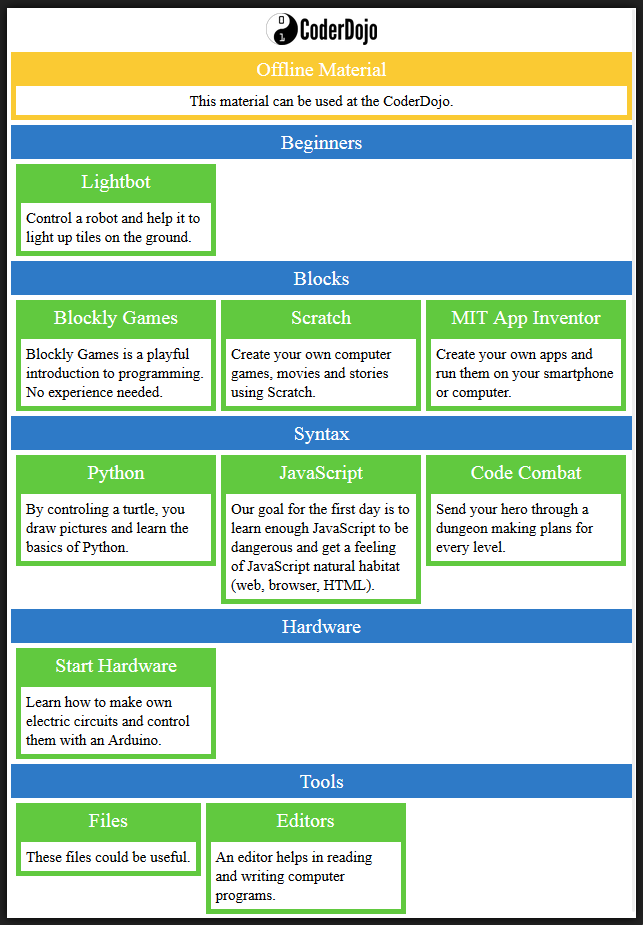

# overview

This module generates the overview page over all the available tutorials and materials. You can try out the static example version by clicking the image below:

## Usage

Each module has a [`module.yml`](./module.yml) file. The contents are loaded all together and a [template](./templates) is rendered for each occurring language.

